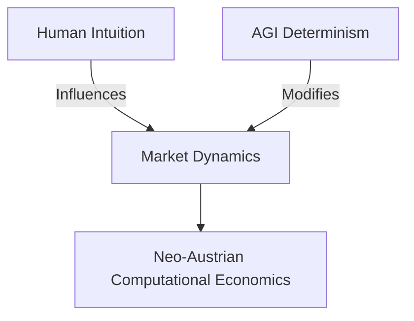
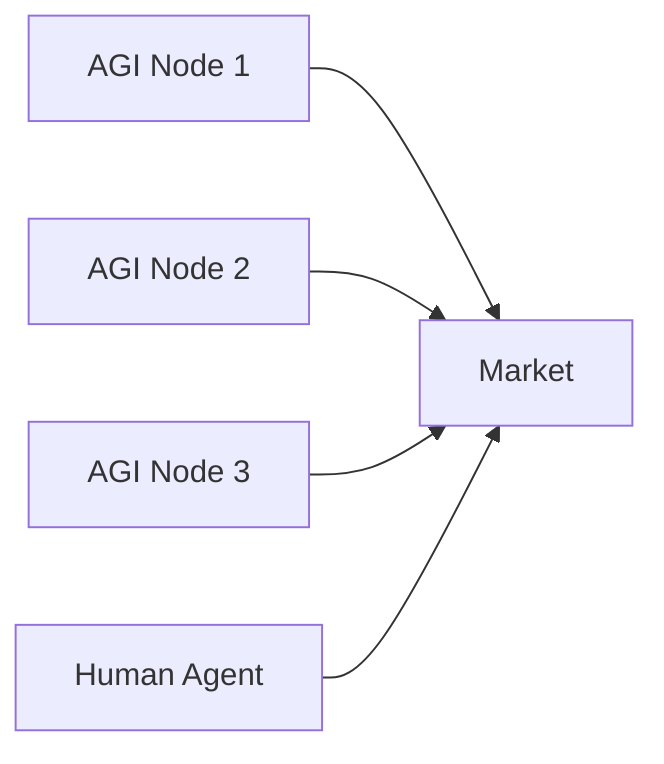

**Neo-Austrian Computational Economics: A Synergistic Approach in the Age of AGI**

*Author: Jascha Wanger (jascha@tarnover.com)*

---

**Abstract**:  
In an era marked by the ascendancy of Artificial General Intelligence (AGI), there is an imperative to revisit and recalibrate our economic paradigms. This paper carves out a space for Neo-Austrian Computational Economics — an integrative framework that melds the time-honored principles of Austrian economics with the cutting-edge methodologies inherent to AGI, providing a visionary lens to navigate the complexities of a post-AGI economy.

**Keywords**: Austrian Economics, Computational Economics, AGI, Decentralization, Human Intuition, Machine Logic.

---

**1. Introduction**

The digital transformation heralded by AGI has reshaped the economic landscape, raising poignant questions about the adequacy and applicability of traditional economic frameworks. The Austrian school, renowned for its emphasis on individualism and decentralized knowledge, offers a foundational perspective. However, the integration of these principles with the dynamism of AGI remains underexplored. This paper, at its crux, bridges this gap, laying the scaffolding for the emergence of Neo-Austrian Computational Economics — a synthesis of human-centered economic traditions and the algorithmic might of AGI.

---

**2. The Austrian Legacy in Contemporary Economics**

Austrian Economics, with its rich tapestry of insights revolving around human behavior, has consistently championed the organic complexities that underpin market dynamics. Central to this is Menger's Subjective Value Theory, which postulates that value is not an inherent quality but is determined by individual perceptions and needs. In the vast, data-rich landscapes of AGI, this subjective determination of value assumes renewed significance. While AGI can process and predict based on colossal datasets, understanding and integrating individual, subjective values into its decision matrix presents a nuanced challenge. The paper delves deep into this confluence, exploring the interfaces and interstices where human subjectivity meets AGI precision.

---

**3. The Deterministic Landscape of AGI**

AGI, characterized by its algorithmic determinism, presents a paradigm shift in economic structures. Its capabilities extend beyond mere task execution, venturing into realms of decision-making hitherto reserved for human agents. This deterministic algorithmic efficiency, while promising unparalleled scalability and precision, introduces unique challenges. AGI's decisions are rooted in data, often sidelining the intangibles that have traditionally driven economic exchanges. This section explores the nuances of AGI's determinism, investigating its implications for market dynamics, price formulations, and economic agent interactions.

---

**4. Bridging Human Instincts with AGI Logic**

The confluence of human intuition and AGI logic forms the epicenter of Neo-Austrian Computational Economics. Humans, with their rich tapestry of emotions, experiences, and intuitions, bring to the table a depth of understanding and unpredictability. AGI, on the other hand, wields the sword of data and pattern recognition, offering precision. The synergy of these seemingly opposite forces can reshape traditional economic models. This section dissects this synergy, exploring the transformative potential inherent in the symbiotic relationship between human intuition and AGI logic.

---

**5. Decentralized Networks in the AGI Ecosystem**

Anchored in Austrian principles of decentralization, we recognize AGI not as isolated units but as nodes in an intricately connected network. These nodes, each processing and disseminating information, evolve and adapt, presenting emergent behaviors that mirror the Austrian concept of spontaneous order. However, the scale and intricacy of these behaviors in a data-driven AGI network are unparalleled. This section ventures into the architecture of these networks, elucidating the dynamics of decentralized AGIs and their implications for market structures.

---

**6. Implications and Future Directions**

As we stand at the confluence of Austrian principles and AGI's capabilities, the path forward is rife with both challenges and opportunities. Trust, a bedrock of traditional markets, assumes a new dimension in the age of AGI. Ensuring transparency, accountability, and equity in AGI-driven decisions becomes paramount. This section not only unravels these challenges but also embarks on a visionary journey, crafting strategies and frameworks that pave the way for a synergistic economic future.

---

**7. Conclusion**

The tapestry of Neo-Austrian Computational Economics, woven with threads of human intuition and AGI prowess, offers a beacon in the evolving economic landscape. As we grapple with the myriad challenges and promises ushered in by AGI, this integrated framework stands as a testament to the potential of harmonious coexistence, steering economies towards a horizon of shared prosperity and innovation.

---

**References**:

- Hayek, F. A. (1945). *The Use of Knowledge in Society*. American Economic Review.
  
- Menger, C. (1871). *Principles of Economics*.

- Russell, S. & Norvig, P. (2010). *Artificial Intelligence: A Modern Approach*.

- Kahneman, D. (2011). *Thinking, Fast and Slow*.
